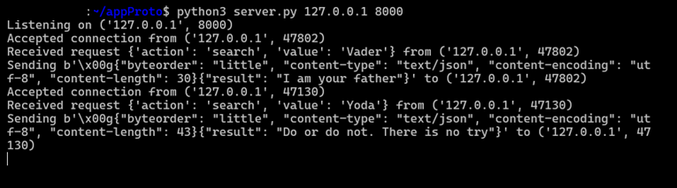
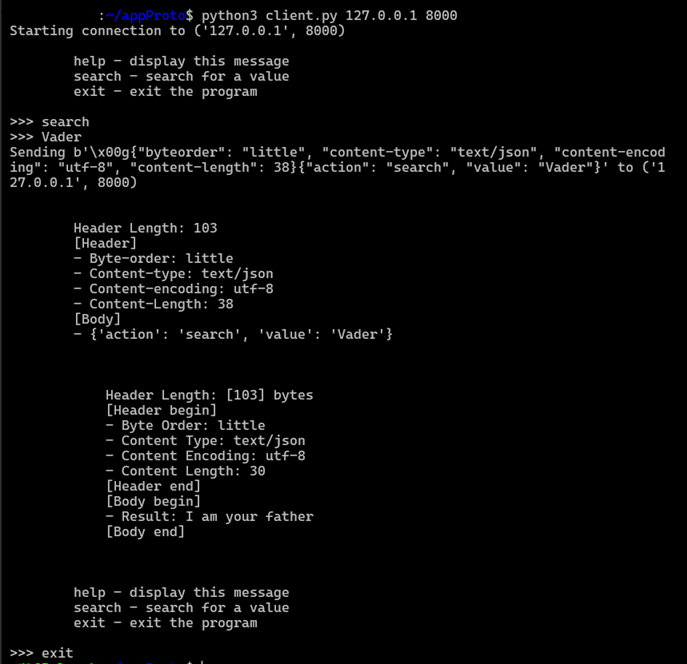

<h1 align="center"> appProto 🛜</h1>

A custom application layer protocol implemented in a multi-user client-server architecture using python sockets and selectors.

## Table Of Contents

- [Features](#features)
- [Architecture](#architecture)
- [Protocol Design](#protocol-design-)
- [Technologies Used](#technologies-used)
- [Project Structure](#project-structure)
- [Running The Project](#running-the-project)
- [Example Output](#example-output)
- [Learning Outcomes](#learning-outcomes)
- [Future Improvements](#future-improvements)


## Features
- Custom application layer protocol design
- Multi-client support through a single server
- Event drive I/O using python selectors
- Concurrent client handling without multi-threading

## Architecture
```
+----------+       +----------+
| client 1 |       | client 2 |
+----------+       +----------+
      \               /
        \           /
          \       /
          +--------+
          | server |
          +--------+
```

The server acts as a central communication hub, managing multiple client connections simultaneously using the selectors module for efficient event multiplexing.

## Protocol Design 
The custom protocol follows the following protocol format:
```
[Header Length]
[Header]
- Byte-order
- Content-length 
- Content-type
- Content-encoding
[Body]
- Body content 
- Content type 
- Content encoding 
```

## Technologies Used
- Python 3.x
- sockets and selectors

## Project Structure
```
project/
|
|---lib/
|------libclient.py
|------libserver.py
|---client.py
|---server.py
|---README.md
|---.gitignore
```

## Running The Project
Start the server
```
python3 server.py 127.0.0.1 8000
```

Start a client(s)
```
python3 client.py 127.0.0.1 8000
```

## Example Output
In the following screenshots two clients conccurently connect to the server and request some data.

Server:


Client 1:


Client 2:


## Learning Outcomes
- Application-layer protocol design
- Network programming with Python
- Event-driven server architectures
- Non-blocking I/O operations
- Message framing and serialization
- Concurrent connection management

## Future Improvements

- Authentication and authorization
- End-to-end encryption
- Client-to-client messaging
- File transfer support
- Protocol versioning
- Performance benchmarking
- WebSocket compatibility